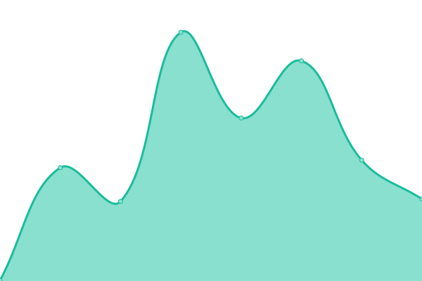

# [📈 Live Status](https://amarouane-ABDELHAK.github.io/ghgc-services-status): <!--live status--> **🟧 Partial outage**

This repository contains the open-source uptime monitor and status page for [Abdelhak Marouane](https://www.itsc.uah.edu/home/personnel/Abdelhak-Marouane), powered by [Upptime](https://github.com/upptime/upptime).

With [Upptime](https://upptime.js.org), you can get your own unlimited and free uptime monitor and status page, powered entirely by a GitHub repository. We use [Issues](https://github.com/amarouane-ABDELHAK/ghgc-services-status/issues) as incident reports, [Actions](https://github.com/amarouane-ABDELHAK/ghgc-services-status/actions) as uptime monitors, and [Pages](https://amarouane-ABDELHAK.github.io/ghgc-services-status) for the status page.

<!--start: status pages-->
<!-- This summary is generated by Upptime (https://github.com/upptime/upptime) -->
<!-- Do not edit this manually, your changes will be overwritten -->
<!-- prettier-ignore -->
| URL | Status | History | Response Time | Uptime |
| --- | ------ | ------- | ------------- | ------ |
|  [GHGC Dashboard](https://earth.gov/ghgcenter) | 🟩 Up | [ghgc-dashboard.yml](https://github.com/amarouane-ABDELHAK/ghgc-services-status/commits/HEAD/history/ghgc-dashboard.yml) | 

 317ms
     
 | 

<a href="https://amarouane-ABDELHAK.github.io/ghgc-services-status/history/ghgc-dashboard">100.00%</a>
    

|  [STAC_API](https://ghg.center/api/stac/_mgmt/ping) | 🟩 Up | [stac-api.yml](https://github.com/amarouane-ABDELHAK/ghgc-services-status/commits/HEAD/history/stac-api.yml) | 

 2897ms
     
 | 

<a href="https://amarouane-ABDELHAK.github.io/ghgc-services-status/history/stac-api">100.00%</a>
    

|  [RASTER_API](https://ghg.center/api/raster/healthz) | 🟩 Up | [raster-api.yml](https://github.com/amarouane-ABDELHAK/ghgc-services-status/commits/HEAD/history/raster-api.yml) | 

 3113ms
     
 | 

<a href="https://amarouane-ABDELHAK.github.io/ghgc-services-status/history/raster-api">100.00%</a>
    

|  [MOSAIC](https://ghg.center/api/raster/mosaic/list) | 🟩 Up | [mosaic.yml](https://github.com/amarouane-ABDELHAK/ghgc-services-status/commits/HEAD/history/mosaic.yml) | 

 250ms
     
 | 

<a href="https://amarouane-ABDELHAK.github.io/ghgc-services-status/history/mosaic">100.00%</a>
    

|  [LINKS](https://ghg.center/api/raster/urlhealthz) | 🟥 Down | [links.yml](https://github.com/amarouane-ABDELHAK/ghgc-services-status/commits/HEAD/history/links.yml) | 

 217ms
     
 | 

<a href="https://amarouane-ABDELHAK.github.io/ghgc-services-status/history/links">0.00%</a>
    

<!--end: status pages-->

[**Visit our status website →**](https://amarouane-ABDELHAK.github.io/ghgc-services-status)

## 📄 License

- Powered by: [Upptime](https://github.com/upptime/upptime)
- Code: [MIT](./LICENSE) © [Anand Chowdhary](https://anandchowdhary.com), supported by [Pabio](https://pabio.com)
- Data in the `./history` directory: [Open Database License](https://opendatacommons.org/licenses/odbl/1-0/)
